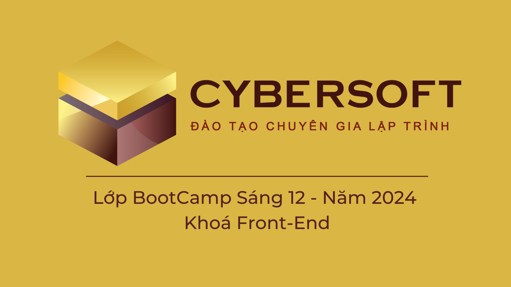

# CYBERSOFT ACADEMY

_(Lớp BootCamp Sáng 12 - Năm 2024 - Khoá Front-End)_

<div align="center">
	<picture>
		
	</picture>
</div>

## [Buổi 10] THỰC HÀNH GIT

# Mục tiêu

1. Version Control System

2. Git và GitHub

3. Cài đặt Git

4. Khởi tạo dự án mới

5. Tham gia vào dự án có sẵn

6. Phát triển dự án

7. Branch

<hr>

> Bài làm của Trương Thục Vân.

# CÁC CÂU LỆNH THỰC HÀNH

## Khởi tạo Repository và Thêm Remote

```sh
git init
```

- Lệnh này khởi tạo một Git repository mới trong thư mục hiện tại. Sau khi chạy lệnh này, một thư mục ẩn .git sẽ được tạo ra.

```sh
git remote add origin https://github.com/MeiCloudie/demo_git.git
```

- Lệnh này thêm một remote repository mới có tên là origin, liên kết đến URL chỉ định.

- Remote repository là một phiên bản Git repository được lưu trữ trên mạng hoặc một máy chủ khác.

- Đường dẫn "https..." là đường dẫn đến repository hiện tại của bạn.

## Thêm và Kiểm tra Trạng thái Thay Đổi

```sh
git add .
```

- Lệnh này thêm tất cả các thay đổi trong thư mục hiện tại vào staging area (khu vực chờ để commit).

```sh
git status
```

- Lệnh này hiển thị trạng thái của working directory và staging area, cho biết những thay đổi nào đã được staged, chưa được staged và những file nào chưa được theo dõi.

## Commit và Xem Lịch Sử Commit

```sh
git commit -m "Initialize project"
```

- Lệnh này tạo một commit mới với thông điệp "Initialize project". Commit là một ảnh chụp của tất cả các thay đổi đã được staged.

```sh
git log
```

- Lệnh này hiển thị lịch sử các commit trong repository, bao gồm thông tin về tác giả, ngày tháng và thông điệp commit.

## Đẩy Thay Đổi Lên Remote Repository

```sh
git push -u origin master
```

hoặc

```sh
git push -u origin main
```

- Lệnh này đẩy các commit từ nhánh master/main lên remote repository origin.

- Tham số -u thiết lập nhánh upstream cho nhánh hiện tại, nghĩa là trong các lần push sau, chỉ cần sử dụng git push mà không cần chỉ định remote và nhánh.

- LƯU Ý: Lệnh **push** sẽ đi kèm với **-u origin** + tên nhánh => **THỰC HIỆN CHO LẦN ĐẦU TIÊN PUSH**!

- Các lần push sau chỉ cần câu lệnh đơn giản là:

```sh
git push
```

> Sau khi code xong 1 phần sẽ thực hiện: `git add .` => `git commit -m "nội dung commit"` => `git push`

## Quản Lý Các Nhánh

```sh
git branch
```

- Lệnh này liệt kê tất cả các nhánh hiện có trong repository, với nhánh hiện tại được đánh dấu bằng dấu sao (\*) hoặc màu xanh.

```sh
git branch nhanh1
```

- Lệnh này tạo một nhánh mới có tên "nhanh1" (chỉ tạo mà CHƯA nhảy qua nhánh nhanh1).

```sh
git checkout nhanh1
```

- Lệnh này chuyển đổi sang nhánh nhanh1 (nghĩa là khi sử dụng `git branch` nhánh hiện tại sẽ được chuyển qua "nhanh1").

```sh
git checkout -b nhanh1
```

- Lệnh này tạo một nhánh mới có tên "nhanh1" và chuyển đổi sang nhánh này ngay lập tức (câu lệnh kết hợp 2 thao tác trên).

## Sao chép Repository

```sh
git clone https://github.com/MeiCloudie/demo_git.git
```

- Lệnh này sao chép một repository hiện có từ một remote repository (URL chỉ định) về máy tính của bạn.

- Nó sẽ tạo một thư mục mới có cùng tên với repository và sao chép tất cả các file và lịch sử commit vào đó.

- Đường dẫn "https..." là đường dẫn của repository bạn muốn clone về.

## Gộp Các Nhánh (Merge)

```sh
git merge nhanh1
```

- Lệnh này gộp các thay đổi từ nhánh "nhanh1" vào nhánh hiện tại.

- Check nhánh hiện tại bằng lệnh `git branch`.

- Nếu có conflict (xung đột), Git sẽ yêu cầu bạn giải quyết xung đột trước khi hoàn thành merge.

## Các Trường Hợp Conflict và Cách Giải Quyết

### Conflict Khi Merge (có xung đột code)

- Khi gộp hai nhánh lại với nhau, nếu có thay đổi khác nhau trên cùng một dòng của cùng một file, hoặc nếu một nhánh thay đổi một file mà nhánh kia đã xóa, thì sẽ xảy ra conflict.

#### Giải quyết conflict:

1. Xem các file bị conflict:

```sh
git status
```

2. Chỉnh sửa file để giải quyết conflict:

- Các phần bị conflict sẽ được đánh dấu bằng các ký hiệu như `<<<<<<<`, `=======`, và `>>>>>>>`. Bạn cần chỉnh sửa các phần này để giữ lại thay đổi mong muốn.

- Bên trên các phần đó sẽ có các option để chọn cập nhật.

3. Thêm file đã giải quyết conflict vào staging area:

```sh
git add <file>
```

- Với `<file>` là file (tệp) bạn vừa thay đổi và muốn cập nhật lại.

4. Hoàn thành merge:

```sh
git commit -m "Resolve Conflict and Merge Code"
```

- Như vậy là đã giải quyết được các xung đột code, sau khi commit có thể sẵn sàng push.

#### Pull và Merge

```sh
git pull origin master
```

- Lệnh này kéo các thay đổi từ nhánh master (hoặc có thể là nhánh `main`, hoặc nhánh hiện tại cần pull) của remote origin và tự động thực hiện merge vào nhánh hiện tại.

- Nếu có conflict, bạn cần giải quyết conflict như đã hướng dẫn ở trên.

#### Rebase

```sh
git rebase <branch>
```

- Lệnh này áp dụng lại các commit của nhánh hiện tại lên trên commit mới nhất của `<branch>`. Nó giúp giữ lịch sử commit gọn gàng hơn so với merge.

- Giải quyết conflict khi rebase:

1. Khi xảy ra conflict, Git sẽ dừng lại và yêu cầu bạn giải quyết conflict:

```sh
git status
```

2. Chỉnh sửa file để giải quyết conflict và thêm vào staging area:

```sh
git add <file>
```

3. Tiếp tục rebase:

```sh
git rebase --continue
```

4. Hủy bỏ rebase nếu cần thiết:

```sh
git rebase --abort
```

> Đã cập nhật xong!

# THAM KHẢO THÊM VỀ GIT

> Mình liệt kê thêm một số link để có thể tham khảo thêm về các câu lệnh của Git. Ưu tiên sử dụng lệnh thay vì các UI trên các IDE nhé!

- [Git Cheatsheet - cs.fyi](https://cs.fyi/guide/git-cheatsheet)

- [GIT CHEATSHEET - GitHub Education](https://education.github.com/git-cheat-sheet-education.pdf)

- [Git Cheat Sheet (2024) - All Git Commands - GeeksforGeeks](https://www.geeksforgeeks.org/git-cheat-sheet/)

- [Git & GitHub Crash Course For Beginners](https://www.youtube.com/watch?v=SWYqp7iY_Tc)

- [Git & GitHub Crash Course 2023](https://youtu.be/ulQA5tjJark?si=a0EqqAUctyxbtdg7)